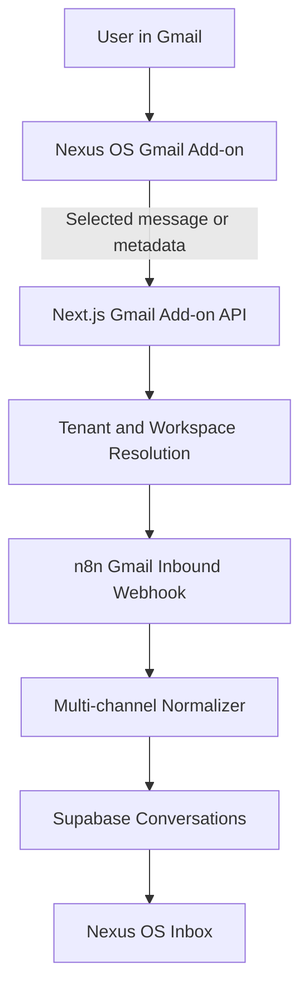

# Gmail Implementation Note

## Summary

The previous Gmail implementation connected a user's mailbox through a normal Google OAuth flow and requested full read-only Gmail access:

```ts
export const GMAIL_SCOPES = [
  "https://www.googleapis.com/auth/gmail.readonly",
  "https://www.googleapis.com/auth/userinfo.email",
].join(" ");
```

That worked for internal testing, but it blocks public launch because `gmail.readonly` is a Google restricted scope. Public access requires Google's OAuth app verification and a CASA security assessment before non-test users can authorize the app.

The new implementation should avoid the broad mailbox OAuth model and move Gmail ingestion to a narrower Gmail add-on / metadata-first flow. The goal is to reduce the data Nexus OS asks for, avoid unnecessary full inbox access, and make the product easier to review, explain, and release.

## Problem With The Last Implementation

The last implementation used `/api/gmail/connect` to redirect users to Google's OAuth consent screen with `gmail.readonly` and `userinfo.email`. After Google returned an authorization code to `/api/gmail/callback`, the app exchanged the code for access and refresh tokens, encrypted those tokens, and stored them in `gmail_credentials`.

The flow was technically correct, but it created release problems:

1. **Restricted scope dependency**

   `gmail.readonly` gives read-only access to Gmail messages and metadata. Google classifies this as a restricted scope. Any public app using it must pass OAuth verification and usually CASA security assessment. Until that is approved, only Google Cloud Console test users can connect.

2. **Public users receive `403: access_denied`**

   When the OAuth consent screen is still in Testing mode, Google only allows emails listed as test users. A normal new customer can create an app account, but cannot connect Gmail unless their email is added to the Google project's test user list.

3. **Preview URLs break OAuth**

   The callback URL is built from `NEXT_PUBLIC_SITE_URL`:

   ```ts
   export function oauthRedirectUri(): string {
     return `${appUrl()}/api/gmail/callback`;
   }
   ```

   If users authenticate through a Vercel preview deployment, the callback host changes per deployment and does not reliably match the redirect URIs registered in Google Cloud.

4. **High review burden for the product stage**

   Full Gmail reading is hard to justify early because Google expects detailed user-facing disclosure, a demo video, proof that each scope is necessary, production legal pages, security controls, and annual reassessment.

5. **Token custody risk**

   The app stores long-lived refresh tokens. They are encrypted at rest, which is correct, but owning refresh tokens for broad Gmail access increases the security and compliance surface area.

## New Gmail Implementation

The new direction is a Gmail add-on / metadata-first implementation instead of full mailbox OAuth.

### Goals

- Avoid requesting full inbox access unless absolutely necessary.
- Let users explicitly send selected Gmail context to Nexus OS from Gmail.
- Reduce stored Google data and long-lived token exposure.
- Make the Google review story simpler: Nexus OS processes only user-selected messages or limited metadata needed for triage.
- Keep the existing internal intake pipeline unchanged where possible.

### Proposed Architecture



### Flow

1. The user installs or opens the Nexus OS Gmail add-on inside Gmail.
2. The add-on reads only the current message context or metadata needed for the action.
3. The add-on sends that selected context to a Nexus OS API endpoint.
4. The API verifies the user/workspace context and forwards the normalized event to the existing n8n Gmail intake pipeline.
5. The existing downstream workflow continues to classify, draft, and display the conversation in the Nexus OS inbox.

### Scope Strategy

The old implementation requested:

- `https://www.googleapis.com/auth/gmail.readonly`
- `https://www.googleapis.com/auth/userinfo.email`

The new implementation should prefer the narrowest scope that supports the add-on behavior. Depending on the final add-on model, this may include a Gmail add-on current-message scope instead of full mailbox read access.

Important: `gmail.metadata` is narrower than `gmail.readonly`, but it is still a restricted Gmail scope. It reduces data exposure but does not necessarily remove Google's restricted-scope verification requirement. A Gmail add-on current-message pattern is usually easier to justify because it is user-initiated and limited to the active message.

### Data Model

The new implementation should avoid storing broad Gmail OAuth refresh tokens when possible. Instead, store only:

- Workspace/user routing identifiers.
- The Gmail address if needed for display and routing.
- Message metadata needed for deduplication and thread grouping.
- Selected message content only when the user explicitly sends it to Nexus OS.

Existing conversation fields can continue to be used:

- `source = "gmail"`
- `external_thread_id`
- `external_permalink` if Gmail deep links are available
- `raw_payload` for original normalized metadata

### API Shape

Recommended new endpoint:

```txt
POST /api/gmail/addon/ingest
```

Expected responsibilities:

- Verify the request is from an authenticated add-on/user context.
- Resolve `team_id`, `workspace_id`, and `user_id`.
- Validate message identifiers and selected content.
- Forward to the existing n8n Gmail inbound webhook or write through the same normalization path.
- Return a small success/failure response for the add-on UI.

### n8n Compatibility

The existing n8n Gmail intake can remain the downstream target if the add-on endpoint emits the same normalized shape expected by WF0a:

- sender email
- recipient email or workspace route key
- subject
- snippet/body when user-selected
- message id
- thread id
- timestamp
- verified tenant context

This keeps Gmail, Meta, and other channels aligned around the current tenant routing, noise filtering, classification, drafting, and inbox display pipeline.

## What Should Change In The Current Code

The current code still contains the old OAuth endpoints:

- `app/api/gmail/connect/route.ts`
- `app/api/gmail/callback/route.ts`
- `app/api/gmail/helpers.ts`
- `components/signup/StepGmail.tsx`

To complete the new implementation:

1. Replace the signup Gmail connection CTA with an add-on installation / connect flow.
2. Stop using `gmail.readonly` as the default signup authorization path.
3. Add a Gmail add-on ingest endpoint.
4. Update the privacy policy to describe the new limited Gmail data model.
5. Keep the old OAuth flow only if it is explicitly needed for internal/admin users, and label it as such.

## Public Release Impact

The old implementation blocks public Gmail connection until Google verification and CASA are complete.

The new add-on / metadata-first implementation does not automatically eliminate Google review, but it gives Nexus OS a much stronger review posture:

- narrower access,
- user-initiated message sharing,
- less token storage,
- clearer Limited Use explanation,
- smaller blast radius if credentials are compromised.

If the final implementation avoids restricted Gmail scopes entirely, public release becomes much simpler. If it still uses `gmail.metadata` or `gmail.readonly`, Google verification remains required, but the narrower design should make approval easier to justify.

## Recommendation

Use the Gmail add-on flow as the default public Gmail integration. Keep full Gmail OAuth only as a fallback or internal feature until the business is ready for Google's restricted-scope verification and CASA process.
